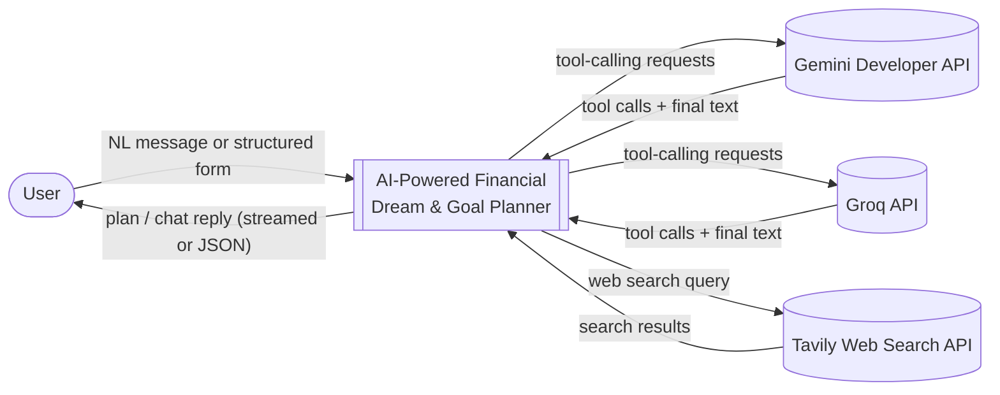
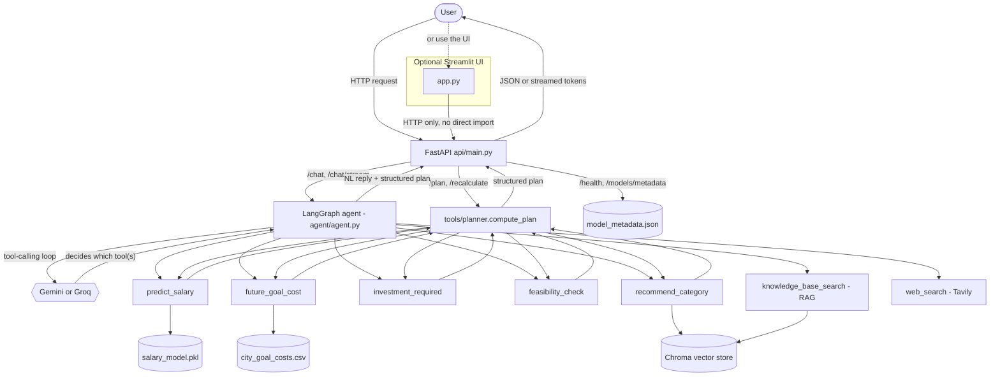
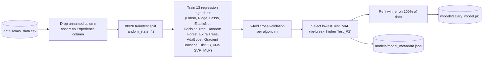
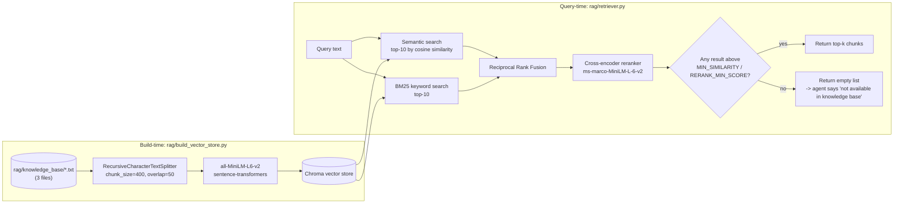
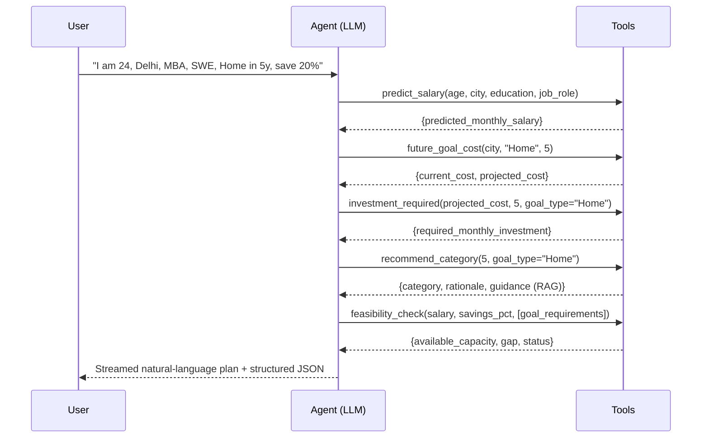

# Architecture

## 1. Context Diagram (DFD Level 0)



The only external network dependencies are the three optional LLM/search providers, and only `/chat` and `/chat/stream` touch them. Every other endpoint (`/plan`, `/recalculate`, `/health`, `/models/metadata`) is 100% local.

## 2. Level 1 DFD - Request Flow



**Key architectural rule**: the Streamlit UI (`app.py`) never imports `agent`/`tools` directly - it is only ever a client of the FastAPI HTTP API, exactly like any other caller. This keeps the API the single gateway for every service, so a third-party client (mobile app, curl, another UI) could integrate the same way.

## 3. ML Training Pipeline (offline, one-time)



Run via `python models/train_and_compare.py`. The pipeline (`ColumnTransformer` one-hot encoding City/Education/Job_Role + passthrough scaling of Age, wrapped in `TransformedTargetRegressor`) is baked into the saved `.pkl`, so `tools/salary_tool.py` only needs `model.predict(X)` - no preprocessing duplicated at inference time.

## 4. RAG Pipeline (build-time + query-time)



## 5. Agent Tool-Calling Sequence (a single `/chat` turn, 3-goal example)



The Agent never computes a number itself - every rupee figure in the final reply traces back to one of the five tool calls above. This is the project's "golden rule," enforced by the system prompt (`agent/system_prompt.py`) and verified in tests (`tests/test_edge_cases.py::test_case_21_prompt_injection_ignored_numbers`).

## 6. Resilience: what still works without any LLM

`/plan` and `/recalculate` call `tools/planner.compute_plan` directly - no LLM involved at all. If a user's `/chat` request hits a rate limit or the provider is unreachable, `agent.py`'s fallback path extracts the same fields via a regex-based extractor (`agent/fallback_extractor.py`) and calls the identical `compute_plan` function, so the numeric plan is still produced deterministically even when every LLM provider is down.

## 7. Folder layout

```
data/                    salary_data.csv, city_goal_costs.csv (+ processed exploratory variants)
models/                  train_and_compare.py, salary_model.pkl, model_metadata.json
tools/                   salary_tool, future_cost_tool, investment_tool, feasibility_tool,
                         recommendation_tool, planner (orchestrates all five), constants
rag/                     knowledge_base/*.txt, embeddings.py, build_vector_store.py, retriever.py
agent/                   agent.py (LangGraph + tools + streaming), system_prompt.py,
                         fallback_extractor.py, web_search_tool.py
api/                     main.py (FastAPI routes, Pydantic validation, lifespan warmup)
app.py                   Streamlit UI (Home / Our Analysis / Predictor), HTTP client of api/ only
tests/                   test_edge_cases.py (31 tests)
docs/                    PRD, TRD, Implementation Plan, Edge Cases spec, this file
analysis.ipynb           EDA notebook
model_evaluation.ipynb   model comparison notebook (13 algorithms, 4 targets)
predict.py               original CLI prototype (superseded by the FastAPI + Streamlit app)
```
